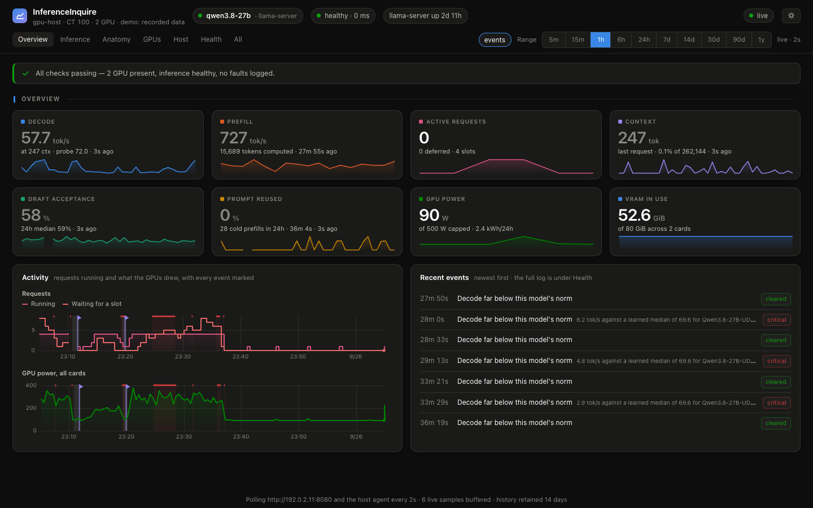

# InferenceInquire

A monitoring dashboard for self-hosted [llama.cpp](https://github.com/ggml-org/llama.cpp)
servers. It puts the GPUs, the host and every request on one page, keeps a
history, and can send alerts to your phone.



## What you get

- Decode and prefill speed for every request, with latency, context depth and
  speculative-decoding acceptance.
- The slots, the KV cache, and the loaded model's real identity and shape.
- GPU power, temperatures, clocks, VRAM, throttling, ECC and PCIe per card,
  against each card's own limits.
- Host CPU, memory, disks, network and, where there is a BMC, its sensors.
- Alerts that know the difference between a model switch and an outage, and a
  learned speed baseline that catches a model silently running on the CPU.
- History for up to two years, in a single SQLite file.
- A phone-friendly page with no build step and no CDN.

## Try it without a GPU

```bash
docker run --rm -p 8000:8000 -e DEMO=1 ghcr.io/nisesen/inferenceinquire:0.1
```

Open http://localhost:8000. Demo mode replays 45 minutes recorded on a real
two-GPU server, over a week of its history.

## Install

InferenceInquire has two parts: the **dashboard**, and an optional **agent**
that reads the GPUs, the host and llama.cpp's log. llama-server needs the
`--metrics` flag either way.

**On a Linux machine with Docker**, where llama.cpp runs in a container or as a
systemd unit:

```bash
git clone https://github.com/nisesen/inferenceinquire.git
cd inferenceinquire
docker compose up -d
```

Then open http://your-machine:8000. The agent finds llama.cpp on its own. For
GPU telemetry it needs the [NVIDIA Container Toolkit](https://docs.nvidia.com/datacenter/cloud-native/container-toolkit/latest/install-guide.html);
without an NVIDIA GPU, delete the `gpus:` line in `compose.yaml`.

**Just the dashboard**, next to any llama-server (a laptop, say):

```bash
# Linux
docker run -d --network host -e LLAMA_URL=http://127.0.0.1:8080 \
  -v inferenceinquire:/data ghcr.io/nisesen/inferenceinquire:0.1
# macOS or Windows (Docker Desktop)
docker run -d -p 8000:8000 -e LLAMA_URL=http://host.docker.internal:8080 \
  -v inferenceinquire:/data ghcr.io/nisesen/inferenceinquire:0.1
```

**Other setups** are in [docs/install.md](docs/install.md): the agent as a
systemd service, a dashboard on another machine, and Proxmox with llama.cpp in
an LXC container.

## What works where

| | Dashboard only | With the agent | On Proxmox |
|---|:-:|:-:|:-:|
| Throughput, requests, slots, KV cache, model identity | ✓ | ✓ | ✓ |
| Per-request timings, latency, depth curves, request health | | ✓ | ✓ |
| GPUs (NVIDIA), host CPU, memory, disks, network | | ✓ | ✓ |
| Model anatomy (from the GGUF header), service state, GPU faults | | ✓ | ✓ |
| BMC sensors and event log | | with `/dev/ipmi0` | ✓ |
| Guests and their memory, Proxmox storage | | | ✓ |

Without the agent, the page hides what it cannot show instead of drawing empty
panels.

## Configuration

Nothing is required. Put settings in a `.env` file next to `compose.yaml`;
[.env.example](.env.example) has the common ones, such as `LLAMA_URL`,
`LLAMA_API_KEY` and `NOTIFY_URLS`. Every setting is listed in
[docs/configuration.md](docs/configuration.md).

## Alerts

Alerts show on the page and in its event log. To get them on your phone, set
`NOTIFY_URLS` to one or more [Apprise](https://github.com/caronc/apprise/wiki)
URLs (ntfy, Telegram, Discord, email and many more), then send a test:

```bash
docker compose exec dashboard python -m inferenceinquire.notify --test
```

[docs/alerts.md](docs/alerts.md) lists the rules and how they avoid false
alarms.

## Security

The page has no login and shows hardware details. Keep it on a network you
trust, or put it behind a proxy with authentication:
[docs/security.md](docs/security.md) has examples for Caddy and Tailscale.
Please report vulnerabilities privately, as [SECURITY.md](SECURITY.md) describes.

## Documentation

- [Installing](docs/install.md) and [configuration](docs/configuration.md)
- [What the pages show](docs/features.md)
- [Alerts and notifications](docs/alerts.md)
- [Reading the numbers](docs/metrics.md): where each figure comes from, and
  the metrics that mislead
- [Security](docs/security.md)
- [Architecture](docs/architecture.md), for contributors

## Contributing

Bug reports, llama.cpp log samples from new builds, and pull requests are
welcome. [CONTRIBUTING.md](CONTRIBUTING.md) explains the setup: demo mode means
you need no GPU to work on the dashboard.

## License

MIT, see [LICENSE](LICENSE). The bundled [uPlot](https://github.com/leeoniya/uPlot)
is MIT as well.
