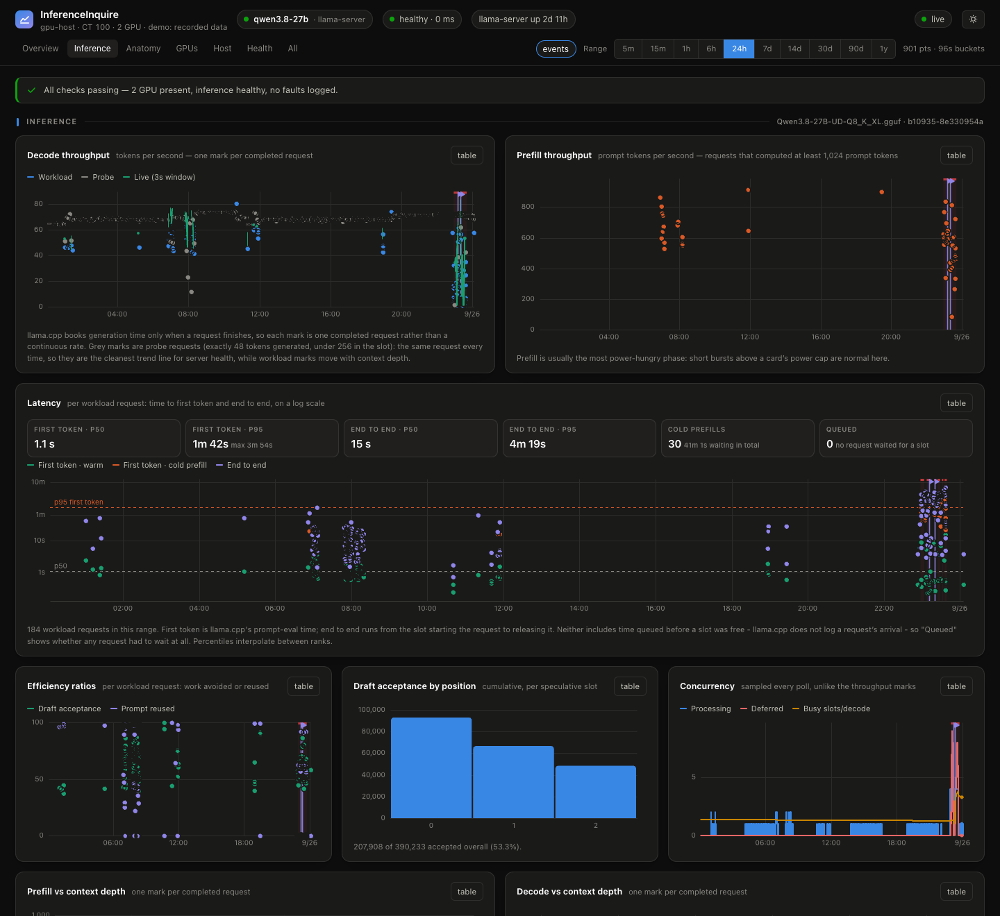
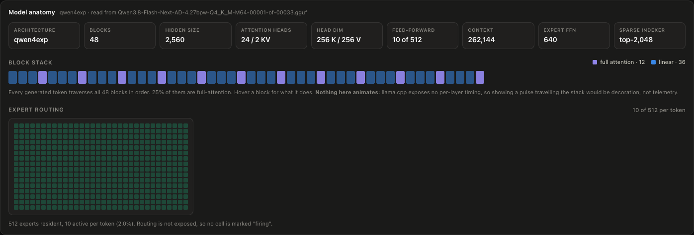
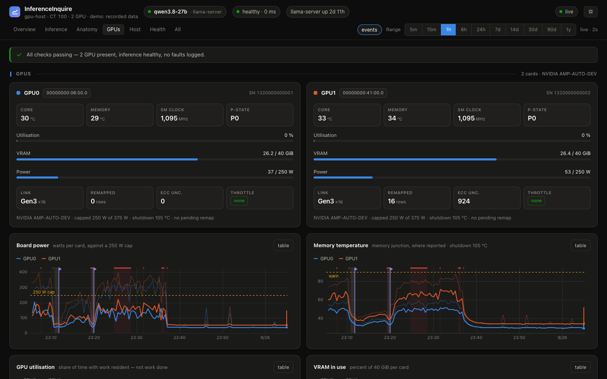
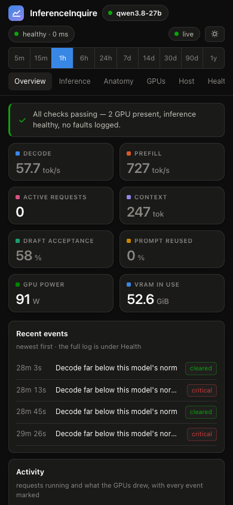

# What the pages show

The page opens on Overview, which answers three questions on a phone's first
screen: is it working, is it busy, and what happened. The other tabs are
Inference, Anatomy, GPUs, Host and Health, and All shows every page in one
scroll. A chart with nothing in its window keeps its size and says so, so the
layout does not jump when you change the range.

Without the agent, the GPUs and Host tabs and the per-request panels are not
shown at all, and the throughput charts plot llama.cpp's own counters instead.

## Overview

The verdict line says whether anything is wrong. Eight tiles give the last
request's decode and prefill speed, the requests running, the context in use,
draft acceptance, prompt reuse, GPU power and VRAM. Below them, a timeline of
requests running over total GPU power, with every event marked, and the newest
events.

## Inference

- Decode and prefill throughput: one mark per completed request.
- Latency, per request on a log scale: time to first token (warm and cold
  prefills coloured apart) and end to end, with p50 and p95 over the range.
  llama.cpp does not log when a request arrived, so neither figure can include
  time spent waiting for a free slot; a "Queued" figure says whether any
  request had to wait.
- Efficiency ratios: draft acceptance and how much of each prompt was
  reused from the cache.
- Draft acceptance by position, for speculative decoding.
- Concurrency: requests running and waiting.
- Throughput against context depth: prefill and decode for each request
  against the sequence length it ran at, which is what a depth benchmark
  measures, read from real traffic.
- Request health: what the throughput charts cannot show. Cold prefills
  (requests that computed 8,192 or more prompt tokens from scratch, and the
  time they took), evictions from llama.cpp's host-RAM prompt cache, prompts
  too big for it, rejected API keys and cancelled requests.
- Energy and usage, per hour or per day: tokens generated, GPU energy
  integrated from the power samples, idle draw, watt-hours per thousand
  tokens, and cost when `ENERGY_PRICE_PER_KWH` is set.
- Slots and the loaded model: the served model's file, build and
  context, and the learned speed baseline.

## Anatomy

Panels that show the server working. Everything drawn is measured, or marked
as not measured.

- Request lifecycle: the stages a request goes through, lit from
  llama.cpp's log: slot selection (with the prompt-cache similarity that
  decided it), prefill, decode, the draft-and-verify loop, and release. Below
  it, a lane per slot with its live generation rate.
- Slot occupancy: a bar for every completed request, coloured by what it
  cost: a warm request, a cold prefill, or a probe.
- KV cache map: what each slot holds against its context window.
- Hardware dataflow: disk, host page cache, PCIe and each card, with real
  byte rates. Traffic between cards shares each card's PCIe counter with host
  transfers and cannot be separated; the panel says so.
- Recent requests, with their timings.
- Model anatomy: the loaded model's shape, read from its GGUF header:
  block count, which layers use full attention, the grouped-query ratio and
  mixture-of-experts sparsity.

Nothing here is animated to look busy. llama.cpp reports no per-layer or
per-expert activity, so the block stack and the expert grid are drawn as
structure, with the live figures beside them.

## GPUs

Per card: core and memory temperature, utilisation, VRAM, power against the
card's own cap, clocks, P-state, PCIe link, remapped rows, ECC and active
throttle reasons. Charts of power, memory temperature, utilisation and VRAM
keep their peaks at long ranges.

## Host

A per-thread CPU heatmap, load, memory, swap, storage, network, and on boards
with a BMC, its sensors against their own thresholds, chassis temperatures and
the main voltage rail.

## Health

The llama.cpp units or containers with their state and restart counts, the
platform, NVIDIA Xid faults, the BMC's event log, and a log of every alert
raised and cleared.

## Event markers

Every time chart carries the event log: a model change is a flagged line, a
restart or model load is a grey span, and an alert is a strip along the top,
coloured by level, from when it was raised to when it cleared. Hover one to see
what it was. The **events** chip turns them off.

## Probe requests

Many setups run a health check that sends the same small request on a timer.
To llama.cpp that is ordinary traffic, and a frequent probe can outnumber real
work and skew every per-request figure.

Give the dashboard the probe's fingerprint and it sets those requests apart:
`PROBE_GEN_TOKENS` is the exact number of tokens the probe generates, and
`PROBE_MAX_TOKENS` a size its slot stays under. Give the probe a distinctive
`max_tokens`. The tiles, ratios and depth curves then describe the workload,
and the probe becomes its own grey series on the decode chart, where it makes
the cleanest trend line there is: the same request, every time.

## Keyboard, phone and links

- <kbd>space</kbd> freezes the view, <kbd>t</kbd> switches light and dark,
  <kbd>e</kbd> toggles the event markers, <kbd>1</kbd>–<kbd>9</kbd> and
  <kbd>0</kbd> pick the range, and the arrow keys step the cursor on a focused
  chart.
- Hovering a chart puts a crosshair at the same moment on every chart.
- Drag across a chart to zoom every chart to that window; the page fetches
  history at a resolution that fits. Double-click, <kbd>esc</kbd> or the banner
  zooms out.
- Click a legend entry to hide that line.
- The address carries the tab, the range, a frozen window and a zoom, so a
  link opens the same view.
- Every chart has a table view.

On a phone the tiles go two across and the tables drop optional columns. The
page can be installed as an app: in Safari, Share, then Add to Home Screen; in
Chrome on Android, Add to Home screen (a real install needs HTTPS there).

The page is light on data. Each 2-second update carries only the sections that
changed, typically about 5 KB; API answers are compressed; a hidden tab draws
nothing and closes its connection after five minutes.
